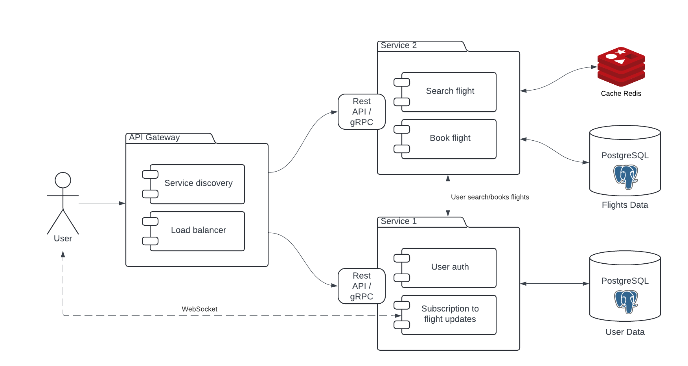

# Flight Booking System
## Application Suitability
* **Scalability**- A flight booking system deals with a high volume of users and transactions, microservices are the solution to enable independent scaling of varying loads.
* **Fault Tolerance** - If one service failes the other services won't be affected.
* **Easier Updates** - We can update or modify one service without stopping the whole application.

**Example** - *Amadeus* uses microservice-based architecture to handle a wide range of services such as flight bookings, hotel reservations, car rentals, and trip planning.

## Service Boundaries
#### Architecture Diagram


#### Key Components
* User: The end-user interacts with the system through an API Gateway.
* API Gateway: Acts as a single entry point for all client requests. It routes requests to the appropriate microservice.
* Service 1: Handles user authentication and subscription to flight updates.
    * User Authentication: Verifies the user's identity or creates a new user profile after registration.
    * Subscription to Flight Updates: Manages user subscriptions for receiving notifications about flight updates.
* Service 2: Responsible for flight search and booking.
    * Search Flight: Queries a PostgreSQL database to retrieve flight information based on the user's search criteria.
    * Book Flight: Processes flight bookings and updates the database.
* Load Balancer: Distributes incoming network traffic across multiple instances of a service to ensure no single instance is overwhelmed.
* Service Discovery: Helps services dynamically find and communicate with each other in a system.

## Technology Stack and Communication Patterns
* **Services** - Python 
* **Databases** - PostgreSQL
* **Cache** - Redis
* **API Gateway** - JavaScript
* **Inter-service communication** - RESTful API / gRPC

## Data Management

#### User/Notification Service
1. POST /register - Register a new user.
    * Request
    ```
    {
        "username": "username",
        "password": "password123",
        "email": "username@example.com"
    }
    ```
    * Response
    ```
    {
        "message": "User registered successfully",
        "userId": "abc123"
    }
    ```
2. POST /login - User login and authentication.
    * Request
    ```
    {
        "username": "username",
        "password": "password123"
    }
    ```
    * Response
    ```
    {
        "message": "Login successful",
        "userId": "abc123",
        "token": "jwt_token"
    }
    ```
3. POST /subscribe-flight - Subscribe a user to real-time flight updates.
    * Request
    ```
    {
        "userId": "abc123",
        "flightId": "FL12345"
    }
    ```
    * Response
    ```
    {
        "message": "Subscribed to flight updates for FL12345"
    }
    ```
4. WebSocket /ws/flight-updates - WebSocket connection to receive real-time flight updates.
    * Request
    ```
    {
        "userId": "abc123",
        "flightId": "FL12345"
    }
    ```
    * Response
    ```
    {
        "flightId": "FL12345",
        "status": "Delayed",
        "delayDuration": "1 hour",
        "reason": "Technical issue"
    }
    ```
5. GET /user-flights/{userId} - Get all flights a user is subscribed to.
    * Response
    ```
    {
        "userId": "abc123",
        "flights": [
            "FL12345",
            "FL67890"
        ]
    }
    ```
#### Flight Booking Service
1. GET /search-flights - Search available flights based on criteria.
    * Request
    ```
    {
        "from": "City M",
        "to": "City L",
        "date": "2024-09-10"
    }
    ```
    * Response
    ```
    {
        "flights": [
            {
                "flightId": "FL12345",
                "airline": "Airline 22",
                "departure": "2024-09-10T12:30:00Z",
                "arrival": "2024-09-10T15:45:00Z",
                "price": 350
            },
            {
                "flightId": "FL67890",
                "airline": "Airline KJ",
                "departure": "2024-09-10T14:00:00Z",
                "arrival": "2024-09-10T17:15:00Z",
                "price": 370
            }
        ]
    }
    ```
2. POST /book-flight - Book a flight for a user.
    * Request
    ```
    {
        "userId": "abc123",
        "flightId": "FL12345",
        "paymentMethod": "credit_card",
    }
    ```
    * Response
    ```
    {
        "message": "Flight booked successfully",
        "bookingId": "bkg56789",
        "flightId": "FL12345",
        "price": 350
    }
    ```
3. GET /bookings/{userId} - Retrieve a user's bookings.
    * Response
    ```
    {
        "userId": "abc123",
        "bookings": [
            {
            "bookingId": "bkg56789",
            "flightId": "FL12345",
            "status": "Confirmed",
            "departure": "2024-09-10T12:30:00Z"
            }
        ]
    }
    ```
4. POST /cancel-booking - Cancel a flight booking.
    * Request
    ```
    {
        "userId": "abc123",
        "bookingId": "bkg56789"
    }
    ```
    * Response
    ```
    {
        "message": "Booking canceled successfully"
    }
    ```

## Deployment and Scaling
For deployment I'll use *Docker* to containerize each microservice, ensuring they run independently with their own dependencies. I will also use *Docker Compose* to manage all services together and *horizontal scaling* ( a Docker Compose’s scaling feature) to allow multiple instances of a service to handle increased traffic efficiently. 