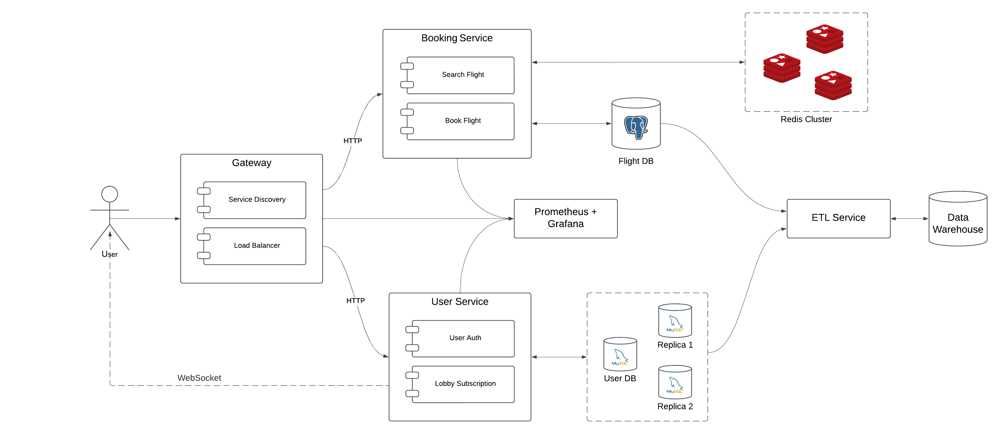

# Flight Booking System
## Application Suitability
* **Scalability**- A flight booking system deals with a high volume of users and transactions, microservices are the solution to enable independent scaling of varying loads.
* **Fault Tolerance** - If one service failes the other services won't be affected.
* **Easier Updates** - We can update or modify one service without stopping the whole application.

**Example** - *Amadeus* uses microservice-based architecture to handle a wide range of services such as flight bookings, hotel reservations, car rentals, and trip planning.

## Service Boundaries
#### Architecture Diagram


#### Key Components
* User: The end-user interacts with the system through an API Gateway.
* API Gateway: Acts as a single entry point for all client requests. It routes requests to the appropriate microservice.
* Service 1: Handles user authentication and subscription to flight updates.
    * User Authentication: Verifies the user's identity or creates a new user profile after registration.
    * Subscription to Flight Updates: Manages user subscriptions for receiving notifications about flight updates.
* Service 2: Responsible for flight search and booking.
    * Search Flight: Queries a PostgreSQL database to retrieve flight information based on the user's search criteria.
    * Book Flight: Processes flight bookings and updates the database.
* Load Balancer: Distributes incoming network traffic across multiple instances of a service to ensure no single instance is overwhelmed.
* Service Discovery: Helps services dynamically find and communicate with each other in a system.

##### New Features
* Redis Cluster: Provides caching for frequently accessed data.
* Prometheus and Grafana: Metrics from all services are centralized here, enabling efficient monitoring, visualization, and alerting.
* Database Redundancy/Replication + Failover: User DB has a replication setup with two additional instances each, supporting high availability and failover to maintain service continuity in case of primary database failure.
* Data Warehouse and ETL: The ETL Service periodically extracts, transforms, and loads data into a Data Warehouse.

## Technology Stack and Communication Patterns
* **Services** - Python 
* **Databases** - PostgreSQL
* **Cache** - Redis
* **API Gateway** - JavaScript
* **Inter-service communication** - RESTful API

## How to Run the Project
### Prerequisites
* Docker and Docker Compose installed
* Clone the repository from GitHub:
    ```
    git clone <repo-url>
    cd <repo-directory>
    ```

### Run with Docker Compose
* Build and Start Containers
    ```
    docker-compose up --build
    ```
    This command builds and runs the containers for all services.

### Docker Commands for Service Management
* Check if Services are Runnin
    ```
    docker ps
    ```

* Stop and Remove Containers
    ```
    docker-compose down
    ```

## Data Models
#### 1. User Table
| Column   | Type    | Description                             |
|----------|---------|-----------------------------------------|
| id       | Integer | Unique identifier for the user          |
| username | String  | Unique username for login               |
| password | String  | User's password                         |
| email    | String  | Unique email address                    |

#### 2. Subscription Table
| Column      | Type    | Description                                              |
|-------------|---------|----------------------------------------------------------|
| id          | Integer | Unique identifier for the subscription                   |
| user_id     | Integer | Identifier for the user associated with the subscription |
| flight_code | String  | Code of the subscribed flight                            |

#### 3. Flight Table
| Column       | Type    | Description                             |
|--------------|---------|-----------------------------------------|
| id           | Integer | Unique identifier for the flight        |
| flight_code  | String  | Unique flight code                      |
| airline      | String  | Name of the airline                     |
| departure    | String  | Departure time                          |
| arrival      | String  | Arrival time                            |
| from_city    | String  | City of departure                       |
| to_city      | String  | City of arrival                         |
| price        | Integer | Price of the flight                     |
| status       | String  | Current status of the flight            |

#### 4. Booking Table
| Column         | Type    | Description                                        |
|----------------|---------|----------------------------------------------------|
| id             | Integer | Unique identifier for the booking                  |
| user_id        | Integer | Identifier for the user making the booking         |
| flight_id      | Integer | Identifier for the booked flight                   |
| status         | String  | Status of the booking                              |
| payment_method | String  | Payment method used for the booking                |

## API Endpoints Documentation
#### Base URL
`http://localhost:4000` - This is the root URL for all endpoints in the service.

#### Status Endpoints 
1. `GET /api/discovery/status` - Retrieves the service discovery status.
    * Response
        ```
        {
            "status": "Service Discovery is running",
            "services": {
                "user_service": [
                    {
                        "url": "http://flight-booking-user_service_1-1:5000",
                        "instance": "user_service_1"
                    },
                    {
                        "url": "http://flight-booking-user_service_3-1:5000",
                        "instance": "user_service_3"
                    },
                    {
                        "url": "http://flight-booking-user_service_2-1:5000",
                        "instance": "user_service_2"
                    }
                ],
                "booking_service": [
                    {
                        "url": "http://flight-booking-booking_service_2-1:5004",
                        "instance": "booking_service_2"
                    },
                    {
                        "url": "http://flight-booking-booking_service_1-1:5004",
                        "instance": "booking_service_1"
                    },
                    {
                        "url": "http://flight-booking-booking_service_3-1:5004",
                        "instance": "booking_service_3"
                    }
                ]
            }
        }
        ```
2. `GET /api/gateway/status` - Retrieves the gateway health status.
    * Response
        ```
        {
            "status": "Gateway is running",
            "port": 4000,
            "uptime": 482.399700277
        }
        ```

#### Database Seeding - Run at Start
1. `GET /seed` - Seeds the database with default flight data if no flights exist.
    * Response:
        ```
        {
            "message": "Default flight data added."
        }
        ```
        `201 Created` - Database seeded with default flight data.
        `200 OK` - Flight data already exists.

#### User/Notification Service
1. `POST /api/auth/register` - Register a new user.
    * Request(JSON)
        ```
        {
            "username": "johndoe",
            "password": "securepassword123",
            "email": "johndoe@example.com"
        }
        ```
    * Response
        * Success (201 Created):
        ```
        {
            "message": "User registered successfully",
            "userId": 1
        }
        ```
        * Error (400 Bad Request):
        ```
        {
            "message": "Username or Email already exists"
        }
        ```
2. `POST /api/auth/login` - User login and authentication.
    * Request(JSON)
        ```
        {
            "username": "johndoe",
            "password": "securepassword123"
        }
        ```
    * Response
        * Success (200 OK):
        ```
        {
            "message": "Login successful",
            "userId": 1,
            "token": "<JWT token>"
        }
        ```
        * Error (401 Unauthorized):
        ```
        {
            "message": "Invalid username or password"
        }
        ```
3. `GET /api/auth/user-subscriptions/{int:user_id}` - Gets a list of all flight subscriptions for a user.
    * Response
        * Success (200 OK):
        ```
        {
            "userId": 1,
            "flights": ["FL001", "FL002"]
        }
        ```

#### Flight Updates Subscription - WebSocket
1. `subscribe` - Allows an authenticated user to subscribe to flight updates.
    * Header
        `Authorization: Bearer \<token>`
    * Data (JSON)
        ```
        {
            "flight_code": "FL001"
        }
        ```
    * Response
        ```
        {
            "message": "Subscribed to flight updates for FL001"
        }
        ```
2. `connect-room` - Connects a user to a specific WebSocket room for a flight's updates.
    * Header
        `Authorization: Bearer \<token>`
    * Data (JSON)
        ```
        {
            "flight_code": "FL001"
        }
        ```
    * Response
        ```
        {
            "message": "Connected to room flight_updates_FL001 for flight updates."
        }
        ```
3. `unsubscribe` - Allows an authenticated user to unsubscribe from flight updates.
    * Header
        `Authorization: Bearer \<token>`
    * Data (JSON)
        ```
        {
            "flight_code": "FL001"
        }
        ```
    * Response
        ```
        {
            "message": "Unsubscribed from flight updates for FL001"
        }
        ```
4. `disconnect-room` - Disconnects an authenticated user from a specific flight update room.
    * Header
        `Authorization: Bearer \<token>`
    * Data (JSON)
        ```
        {
            "flight_code": "FL001"
        }
        ```
    * Response
        ```
        {
            "message": "Disconnected from room flight_updates_FL001."
        }
        ```
5. `broadcast_update` - DBroadcasts an update to all users in a flight's WebSocket room.
    * Header
        `Authorization: Bearer \<token>`
    * Data (JSON)
        ```
        {
            "flight_code": "FL001",
            "update": "Flight is now boarding"
        }
        ```
    * Response
        Broadcasts the update to all users in the specified room.
        ```
        {
            "update": "Flight is now boarding"
        }
        ```

#### Flight Booking Service
1. GET /api/flight/search-flights - Search available flights based on criteria.
    * Query Parameters:
        * `from` (string, required): Departure city.
        * `to` (string, required): Arrival city.
    * Response
        * Success (200 OK):
        ```
        {
            "flights": [
                {
                    "flightCode": "FL001",
                    "airline": "WizzAir",
                    "departure": "2024-10-01 10:00",
                    "arrival": "2024-10-01 12:00",
                    "price": 200,
                    "status": "On Time"
                }
            ]
        }
        ```
        * Error (404 Not Found):
        ```
        {
            "message": "No flights found"
        }
        ```
2. POST /api/flight/book-flight - Book a flight for a user.
    * Header
        `Authorization: Bearer \<token>`
    * Request(JSON)
        ```
        {
            "flightId": "FL001",
            "paymentMethod": "credit_card"
        }
        ```
    * Response
        * Success (201 Created):
        ```
        {
            "message": "Flight booked successfully",
            "bookingId": 1,
            "flightId": "FL001",
            "price": 200
        }
        ```
        * Error (404 Not Found):
        ```{
            "message": "Flight not found"
        }
        ```
3. GET /api/flight/bookings/{int:user_id>} - Retrieve a user's bookings.
    * Header
        `Authorization: Bearer \<token>`
    * Response
        * Success (200 OK):
        ```{
            "userId": 1,
            "bookings": [
                {
                    "bookingId": 1,
                    "flightCode": "FL001",
                    "bookingStatus": "Confirmed",
                    "departure": "2024-10-01 10:00",
                    "flightStatus": "On Time"
                }
            ]
        }
        ```
        * Error (404 Not Found):
        ```{
            "message": "No bookings found for this user"
        }
        ```
4. DEL /api/flight/cancel-booking/{int:booking_id>} - Cancel a flight booking.
    * Header
        `Authorization: Bearer \<token>`
    * Response
        * Success (200 OK):
        ```
        {
            "message": "Booking canceled successfully"
        }
        ```
        * Error (404 Not Found):
        ```
        {
            "message": "Booking not found"
        }
        ```

#### Testing Endpoint
1. `GET /api/auth/simulate-failure` - This endpoint is used to simulate a failure. It is primarily for testing the circuit breaker.
    * Response
        * When the circuit breaker is active and blocking requests:
        ```
        {
            "message": "user_service_1 is temporarily unavailable due to failures."
        }
        ```

## Deployment and Scaling
For deployment I'll use *Docker* to containerize each microservice, ensuring they run independently with their own dependencies. I will also use *Docker Compose* to manage all services together and *horizontal scaling* ( a Docker Compose’s scaling feature) to allow multiple instances of a service to handle increased traffic efficiently. 